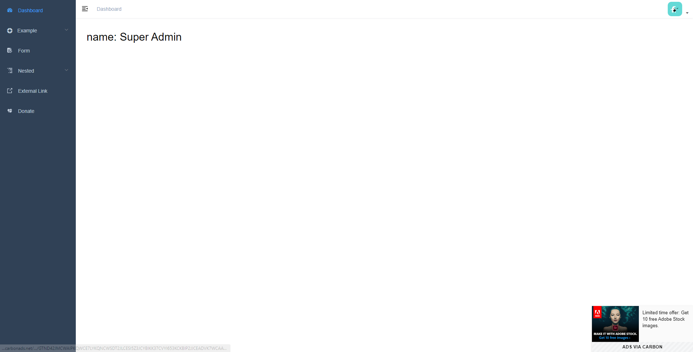
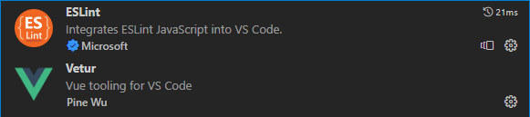

# 环境搭建

## 基座项目介绍

我们学习开发的项目是`人力资源管理系统`,是一个二次开发的后台管理系统。所谓的二次开发，就是基于一个已经开发好的项目(我称为基座项目)，在该(基座)项目的基础上进行修改而完成开发的项目。这样做的好处是开发周期短，效率高。

我们这次用的基座项目是 [vue-element-admin](https://panjiachen.gitee.io/vue-element-admin-site/zh/)

它是一个后台管理系统的前端解决方案，它基于 `vue` 和 `element-ui` 实现。它使用了最新的前端技术栈，内置了 i18 国际化解决方案，动态路由，权限验证，提炼了典型的业务模型，提供了丰富的功能组件，它可以帮助你快速搭建企业级中后台产品原型。不过它不适合当基础模板来进行二次开发，因为它是一个成熟的集成方案，更适合用来学习编程思路...

幸运的是，它还有一个基础模板[vue-admin-template](https://github.com/PanJiaChen/vue-admin-template),我们学习开发的`人力资源管理系统`正是基于[vue-admin-template]来进行二次开发的。



## 环境检查

### node环境

nodejs是当下前端工程化开发必不可少的环境, 使用 node的**`npm`**功能来管理依赖包

```bash
node -v #查看node版本
npm  -v #查看npm版本
```

### git环境

查看git安装版本

```bash
git --version #查看git安装版本
```

### npm镜像源

如果用 npm,  不用 yarn, 一定要配置淘宝镜像

```bash
npm config set registry  https://registry.npm.taobao.org/  #设置淘宝镜像地址
npm config get registry  #查看镜像地址
```

如果在你的电脑中，有的项目需要国内镜像有的不需要，可以使用`.npmrc`文件:

.npmrc，可以理解成npm running cnfiguration, 即npm运行时配置文件。
简单点说， .npmrc 可以设置 package.json 中依赖包的安装来源，既从哪里下载依赖包。
项目下 .npmrc 文件的优先级最高，可以给每个项目配置不同的镜像，项目之间的配置互不影响。

```bash
# /.npmrc
registry=https://registry.npm.taobao.org
```

### vscode插件

vscode编辑器是目前前端开发的编码利器， 以及丰富的插件系统，非常适合开发前端项目

vscode编辑器插件 + **`vetur`**（基于单文件组件开发的支持插件） + **`eslint`**（基于代码校验的插件）



除此之外, eslint需要在vscode中进行一些参数的配置

```json
{ 
  "editor.codeActionsOnSave": {
      "source.fixAll.eslint": true
  },
}
```

## 项目创建

* **git拉取基础项目模板**
拉取基础模板的代码

```bash
git clone https://github.com/PanJiaChen/vue-admin-template.git
```

git 下载完毕后, 可以将 .git 文件夹删除, 我们后面自己初始化

* **安装项目依赖**（定位到项目目录下）

```bash
#安装依赖 yarn
npm i 
```

**启动项目*

```bash
#启动开发模式的服务 yarn dev
npm run dev 
```

效果如下:


* **目录结构**

```text
hrms
├── 📂build              # 构建打包相关
├── 📂mock               # 项目mock 模拟数据
├── 📂public             # 静态资源
│   │── favicon.ico              # favicon图标
│   └── index.html               # html模板
├── 📂src               # 源代码
│   ├── 📂api             # 所有请求
│   ├── 📂assets          # 主题 字体等静态资源
│   ├── 📂components      # 全局公用组件
│   ├── 📂icons           # 项目所有 svg icons
│   ├── 📂layout          # 全局 layout
│   ├── 📂router          # 路由
│   ├── 📂store           # 全局 store管理
│   ├── 📂styles          # 全局样式
│   ├── 📂utils           # 全局公用方法
│   ├── 📂vendor          # 公用vendor
│   ├── 📂views           # views 所有页面
│   ├── 📄App.vue              # 入口页面
│   ├── 📄main.js              # 入口文件 加载组件 初始化等
│   └── 📄permission.js        # 权限管理
│   └── 📄settings.js          # 配置文件
├── 📂tests               # 测试
├── 📄.editorconfig       # 代码风格配置    
├── 📄.env.development    # 开发环境下的配置文件
├── 📄.env.production     # 生产环境下的配置文件
├── 📄.env.staging        # 测试环境下的配置文件
├── 📄.eslintignore       # 配置eslint忽略文件和目录
├── 📄.eslintrc.js        # eslint 配置项
├── 📄.gitignore          # git忽略文件配置
├── 📄.travis.yml         # 持续集成服务配置项
├── 📄babel.config.js     # babel 配置项
├── 📄jest.config.js      # jest 配置项
├── 📄jsconfig.json       # 表明该目录是 JavaScript 项目的根目录
├── 📄LICENSE             # 协议
├── 📄package.json        # 应用的配置文件
├── 📄postcss.config.js   # postcss 配置项
├── 📄README-zh.md        # 中文文档
├── 📄README.md           # 英文文档
└── 📄vue.config.js       # Vue CLI生成的可选配置文件
```
