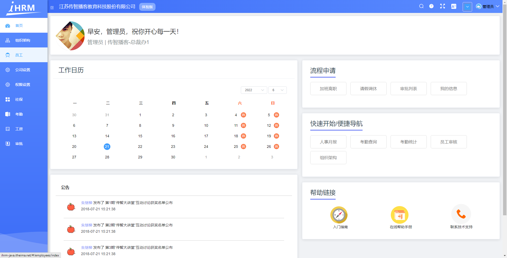

# 项目介绍

这一小节，我们来对项目做一个简单的介绍，让大家了解项目名称、项目背景、项目技术栈、项目的功能模块等

## 项目名称

* 项目名称: **iHRM 人力资源管理系统**(Human Resource Management System)
* 在线预览: [http://ihrm-java.itheima.net/#/dashboard](http://ihrm-java.itheima.net/#/dashboard)



## 项目背景

iHRM人力资源管理系统是一款在线HR人力资源管理系统。
帮助企业管理人事信息、员工档案、绩效考核等。
利用HR软件发挥最核心资源-人力的最大价值，通过企业人事HR管理人力资源，从而保持人才竞争力。

## 项目技术栈

### 前端

1. Vue-element-admin 后台前端解决方案
2. Vuex分模块状态共享及持久化方案
3. Token失效的两种续签解决方案
4. Element中Tree型组件等树形业务的应用方案
5. RBAC权限设计方案
6. 通用上传组件封装思路
7. 请求拦截应用及异步编程解决方案
8. 导入导出Excel

### 后端

1. Spring全家桶解决方案
2. SPA工程构建解决方案
3. Saas系统数据库设计方案
4. 更多省略.....

## 项目的功能模块

```bash
📂 人力资源后台管理系统
├ 登录
├ 首页
├ 组织架构
├ 公司设置
├ 权限设置
├ 社保
├ 考勤
├ 工资
└ 审批
```
