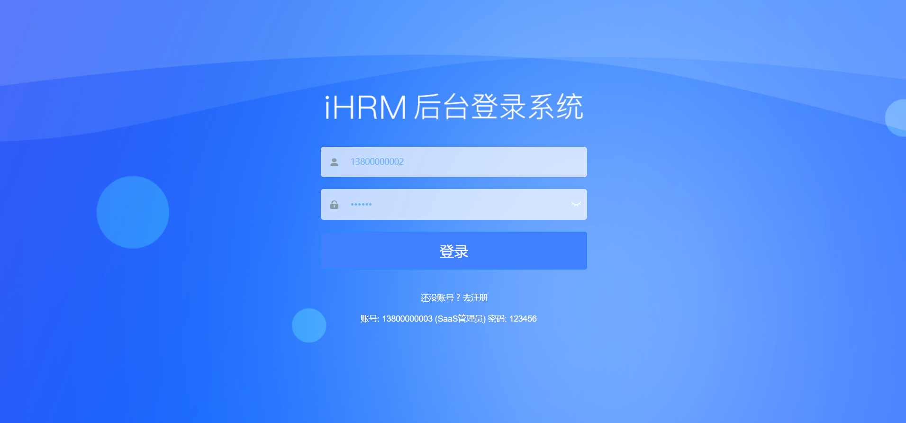

# 登录-页面布局

这一小节，我们来把基座项目(vue-element-template)的登录页面改成我们要求的布局和样式

示例如下:



## Step.1 设置头部背景

```html
<!-- 放置标题图片 @是设置的别名-->
<div class="title-container">
  <h3 class="title">
    
  </h3>
 </div>
```

## Step.2 设置背景图片

```css
/* 设置背景图片 */
.login-container {
  /* 在样式表中使用 @ 别名的时候，需要在@前面加上一个 ~ 符号，否则不识别 */
  background-image: url('~@/assets/common/login.jpg');
  /* 将图片位置设置为居中 */
  background-position: center; 
}
```

## Step.3 设置输入表单整体背景色

```css
.el-form-item {
  border: 1px solid rgba(255, 255, 255, 0.1);
  /* 输入登录表单的背景色 */
  background: rgba(255, 255, 255, 0.7);
  border-radius: 5px;
  color: #454545;
}
```

## Step.4 设置错误信息的颜色

```css
.el-form-item__error {
  color: #fff
}
```

## Step.5 设置登录按钮的样式

```css
.loginBtn {
  background: #407ffe;
  height: 64px;
  line-height: 32px;
  font-size: 24px;
}
```

## Step.6 修改显示的提示和登录文本

```html
<div class="tips">
  <span style="margin-right:20px;">账号: 13800000002</span>
  <span> 密码: 123456</span>
</div>
```
