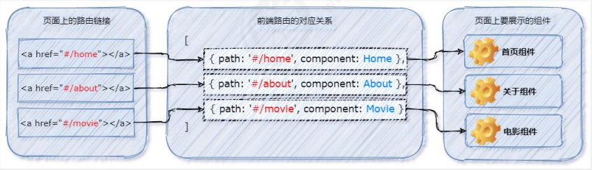

# 前端路由的概念与原理

::: tip Object
这一小节，我们的目标是 了解前端路由的概念与原理
:::

::: warning Path

1. 什么是前端路由
2. 前端路由的工作方式
3. 实现简易的前端路由
:::

::: info Experience

* **Kn. 1：什么是前端路由**

  通俗易懂的概念：Hash 地址与组件之间的对应关系

* **Kn. 2：前端路由的工作方式**

  * ① 用户点击了页面上的路由链接
  * ② 导致了 URL 地址栏中的 Hash 值发生了变化
  * ③ 前端路由监听了到 Hash 地址的变化
  * ④ 前端路由把当前 Hash 地址对应的组件渲染都浏览器中

  

* **Kn. 3：实现简易的前端路由**

  * ① 通过 `<component>` 标签，结合 `comName` 动态渲染组件。

    ```js
    <component :is="comName"></component>

    export default {
      name: 'App',
      data(){
        return {
          // 要展示的组件的名称
          comName: 'Home'
        }
      }
    }
    ```

  * ② 在 `App.vue` 组件中，为 `<a>` 链接添加对应的 hash 值

    ```html
    <a href="#/home">Home</a>&nbsp;
    <a href="#/movie">Movie</a>&nbsp;
    <a href="#/about">About</a>
    ```

  * ③ 在 `created` 生命周期函数中，监听浏览器地址栏中 `hash` 地址的变化，动态切换要展示的组件的名称

    ```js
    created(){
      window.onhashchange = () => {
        switch (location.hash) {
          // 点击了"首页"的链接
          case '#/home':
            this.comName = 'Home'
            break;

          // 点击了"电影"的链接
          case '#/movie':
            this.comName = 'Movie'
            break;        

          // 点击了"关于"的链接
          case '#/about':
            this.comName = 'About'
            break;
        }
      }
    }
    ```

:::

::: danger Note

* 【重点】

  1. 什么是前端路由
  2. 前端路由的工作方式
  3. 实现简易的前端路由

* 【难点】

  1. 前端路由的工作方式
:::
