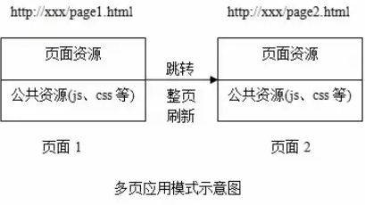
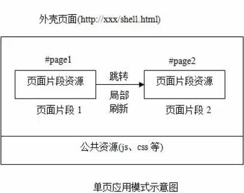
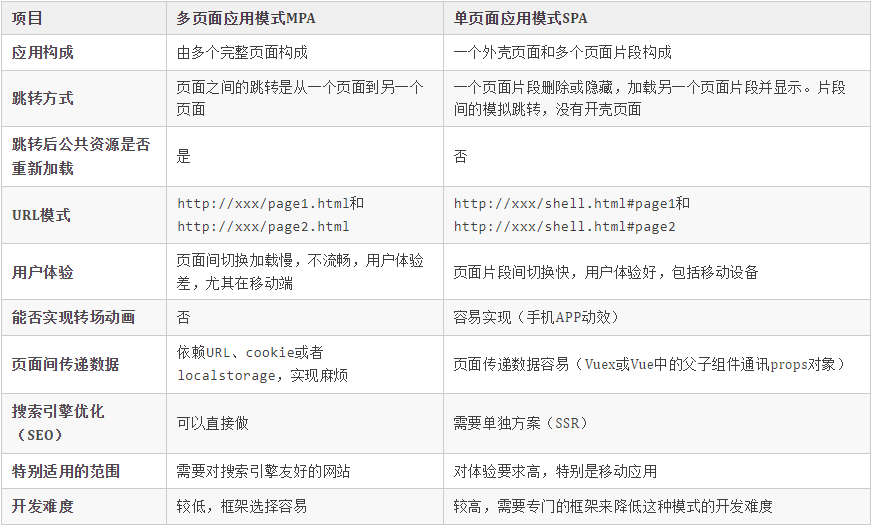

# 单页面应用

::: tip Object
这一小节，我们的目标是: 了解单页面应用的相关知识，了解它对我们有什么意义呢？原因是只有知道了单页面应用的相关知识，我们才能明白 `VueRouter` 能干什么
:::

::: warning Path

1. 多页面应用的概念
2. 多页面应用的特点
3. 单页面应用的概念
4. 单页面应用的特点

:::

::: info Experience

* **Kn. 1： 多页面应用的概念**

  多页面（MPA:mutiple page application），就是指一个应用中有多个页面，每一次页面跳转的时候，后台服务器都会返回一个新的HTML文档，每个页面的JavaScript文件、CSS文件、图片都会重新加载，无论是公共的还是独有的。

  

* **Kn. 2： 多页面应用的特点**

  * 首屏展现快

    首屏时间叫做页面首个屏幕的内容展现的时间，当我们访问页面的时候，服务器返回一个html，页面就会展示出来，这个过程只经历了一个HTTP请求，所以页面展示的速度非常快
  
  * 搜索引擎优化效果好

    搜索引擎在做网页排名的时候，要根据网页的内容才能给网页权重，来进行网页的排名。搜索引擎是可以识别html内容的，而我们每个页面所有的内容都放在html中，所以这种多页应用SEO排名效果好。

  * 页面切换慢

    每次跳转都需要发送一个HTTP请求，如果网络状态不好，在页面间来回跳转时，就会发生明显的卡顿，影响用户体验。

* **Kn. 3： 单页面应用的概念**

  单页面应用（SPA:single page application），就是指一个应用中只有一个html页面的应用，是一种从 Web服务器加载的富客户端，单页面跳转仅刷新局部资源，公共资源比如JavaScript文件、CSS文件仅加载一次，第一次进入页面时会请求一个 HTML 文件，刷新清除一些，切换到其他组件，此时路径也相应变化，但是并没有新的 HTML 文件。
  其实这个 HTML 文件中只有一个空的`div`标签，其他都是 JavaScript 动态生成的内容。 此时，不同内容之间的切换需要通过前端路由来实现。

  

* **Kn. 4： 单页面应用的特点**

  * 首屏展现慢

    单页面应用的首屏时间比多页面应用慢，因为首屏需要请求一次 HTML , 页面中的内容还需要通过发起第二次请求 JavaScript,通过JavaScript来动态把页面渲染好，首屏才会展示出来，因此比较慢。
  
  * 搜索引擎优化(SEO)效果差

    搜索引擎只认识 网页中的静态内容，不认识 JavaScript 动态渲染生的内容，既然不认识，也就不会在用户搜索相关内容的时候给予好的排名，这样就导致了单页面应用在搜索引擎上的排名差，但这个问题其实最后也被 服务器端渲染 技术解决了。另外 在当今这个移动互联网时代，搜索引擎的重要性是逐步降低的，我们一般很少在移动端用搜索引擎搜索信息。

  * 页面切换快

    页面在每次切换跳转时，并不需要再次发起请求，这样就节约了很多 HTTP 发送接收数据的延迟，所以我们在切换页面的时候速度很快，这也给用户提供了良好的体验...

:::

::: danger Note

* 【重点】

  1. 多页面应用的特点
  2. 单页面应用的概念
  3. 单页面应用的特点

* 【面试题】

  * 单页面与多页面的异同点

  

:::
