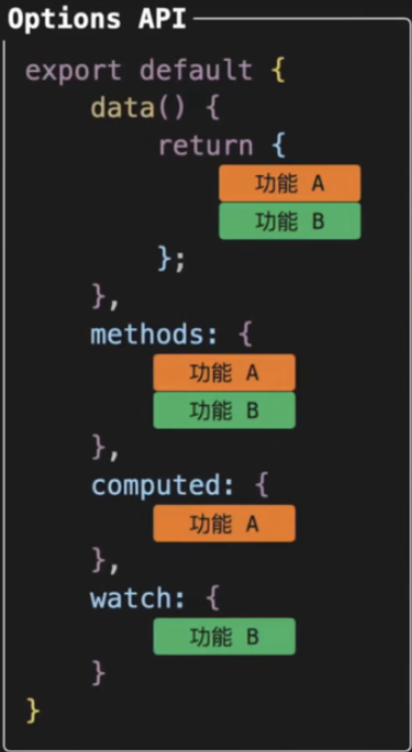
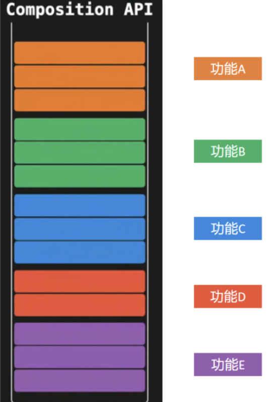

# API 风格

::: info Object
Vue 的组件可以按两种不同的风格书写：选项式 API 和组合式 API。这一小节，我们就来回顾一下选项式API，并认识一种新的Vue组件书写风格: 组合式API
:::

::: tip Path

1. 选项式 API (Options API)
2. 选项API的优缺点
3. 组合API
4. 组合API的优缺点

:::

::: warning Experience

## Kn.1：选项式 API (Options API)

 **选项式 API：用包含多个选项的对象来描述组件的逻辑的Vue组件写法** ，例如data、methods 和 mounted。选项所定义的属性都会暴露在函数内部的 this 上，它会指向当前的组件实例。

 

 ```vue
  <script>
  export default {
    // data() 返回的属性将会成为响应式的状态
    // 并且暴露在 `this` 上
    data() {
      return {
        count: 0
      }
    },
  
    // methods 是一些用来更改状态与触发更新的函数
    // 它们可以在模板中作为事件监听器绑定
    methods: {
      increment() {
        this.count++
      }
    },
  
    // 生命周期钩子会在组件生命周期的各个不同阶段被调用
    // 例如这个函数就会在组件挂载完成后被调用
    mounted() {
      console.log(`The initial count is ${this.count}.`)
    }
  }
  </script>
  
  <template>
    <button @click="increment">Count is: {{ count }}</button>
  </template>
  
 ```

## Kn.2：选项API的优缺点

咱们在vue2.x项目中使用的就是 `选项API` 写法：

- 优点：易于学习和使用，写代码的位置已经约定好(适合初学者)
- 缺点：代码组织性差，相似的逻辑代码不便于复用，逻辑复杂代码多了不好阅读。(不适合大型项目)

## Kn.3：组合式 API (Composition API)

**组合式 API：组合式 API (Composition API) 是一系列 API 的集合，使我们可以使用函数而不是声明选项的方式书写 Vue 组件** ，使用组合式API的标识是setup入口函数，
这个 setup ，告诉 Vue 需要在编译时进行一些处理，让我们可以更简洁地使用组合式 API。

 

```vue
<script>

export default {
  setup(){
    import { ref, onMounted } from 'vue'

    // 响应式状态
    const count = ref(0)

    // 用来修改状态、触发更新的函数
    function increment() {
      count.value++
    }

    // 生命周期钩子
    onMounted(() => {
      console.log(`The initial count is ${count.value}.`)
    })
  }
}

</script>

<template>
  <button @click="increment">Count is: {{ count }}</button>
</template>

```

## Kn.4：组合API的优缺点

咱们在vue3.0项目中将会使用 `组合API` 写法：

- 优点：功能逻辑复杂繁多情况下，各个功能逻辑代码组织再一起，便于阅读和维护
- 更好的逻辑复用
- 更灵活的代码组织
- 更好的类型推导
- 更小的生产包体积
- 缺点：需要有良好的代码组织能力和拆分逻辑能力，PS：大家没问题。
- 补充：为了能让大家较好的过渡到vue3.0的版本来，`也支持vue2.x选项API写法`

:::

::: danger Note

- 【重点】
- 【难点】
- 【注意点】
:::
