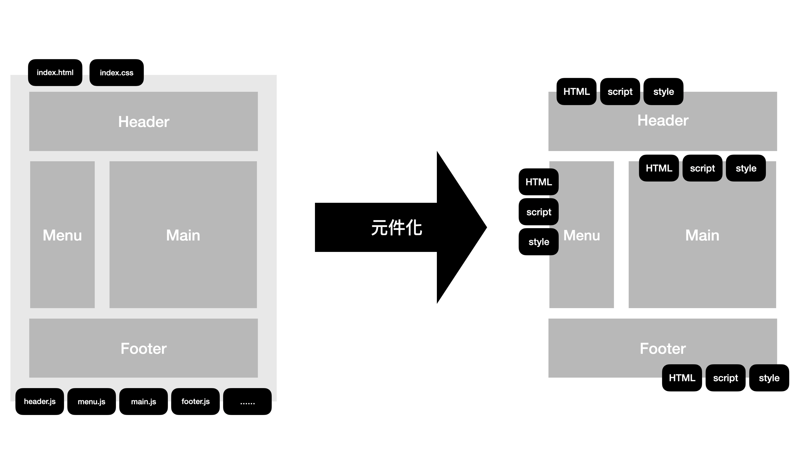

# 组件基础

::: tip Object
这一节，我们的目标是学习组件的概念，学习组件注册的语法，为什么要学习组件呢？

有时候我们会遇到一些场景，比如：

* 页面逻辑越来越多，代码量越来越多，写到后面很难知道所有的逻辑，很容易一改就是一大片
* 自己页面好好的突然出现问题，结果是别人代码的影响
* 同样的逻辑在多个地方重复书写，每次都需要改一堆文件

而组件化的出现就是为了解决这些问题的。
:::

::: warning Path

1. 组件的概念
2. 组件的分类
3. 组件的注册方式
4. 组件的命名规则
5. 基本组件三要素(模板、数据、方法)

:::

::: info Experience

## 1. 组件的概念

所谓组件，即封装起来的具有独立功能的UI部件。现在的前端开发都是推荐以组件化的方式去重新思考 UI 构成， 将 UI 上 每一个功能相对独立的模块定义成组件，然后将小的组件通过组合或者嵌套的方式构成大的组件，最终完成整体 UI 的构建。



每一个被封装后的组件单元，都含有自己的模板(template)、样式(style)、行为逻辑(JavaScript)，并且可以被重复使用。

## 2. 组件的分类

当我们开始要把网页转换成组件区域来管理的是，首先面临的问题是，组件应该怎么拆，从哪里开始拆起。
要是范围切的太大，组件过于庞大，切的太细则组件数量太多。再有，组件之间要是彼此耦合程度高，反而不容易维护，还不如不拆。那么，接下来我们看看常见的组件分类方法：

* **展示型组件**

负责呈现 UI 为主的类型，我们很单纯地把资料传递进去，然后 DOM 就根据我们传递进去的数据生成出来。这种组件的好处是可以提升 UI 的重复使用。

* **容器型组件**

负责与数据层的 service 沟通， 包含了与 server 端、数据来源做沟通的逻辑，然后再将数据传递给前面所说的展示型组件。

* **互动型组件**

负责互动的逻辑，比如 elementUI、bootstrap等 UI Library 都属于这种类型。强调重复使用，像是表单、灯箱等各种互动元素都属于这个类型

* **功能型组件**

这个类型的组件本身不渲染任何内容，主要负责将组件内容作为某种应用的延伸，或是某种机制的封装。像是`<transition>`、`<rouuter-view>`等。

## 3. 组件的注册方式

* **全局组件**

```html
<script>
    // 创建Vue实例
    const app = Vue.createApp({
      data() {
        return {
          name: "WanLum"
        }
      }
    });

    app.component("组件名称", {
      template: `模板`,
      data() {
        // ...省略代码
      },
      methods: {
        // ...省略代码
      },
      computed: {
        // ...省略代码
      },
      // ...以及其他选项、各种 lifecycle等
    })

    // 把Vue实例挂载在id为app的div上
    vm.mount('#app');
  </script>
```

* **局部组件**

```html
<script>
 const app = Vue.createApp({
      data() {
        // ...省略代码
      },
      components: {
        组件名称: {
          template: `模板`,
          data() {
            // ...省略代码
          },
          methods: {
            // ...省略代码
          },
          computed: {
            // ...省略代码
          },
          // ...以及其他选项、各种 lifecycle
      }
    });
  </script>
```

## 4. 组件的命名规则

虽然说只要是合法的 JavaScript 属性名，都可以被当作 Vue 组件的名称，但是为了统一代码，我们规定在**注册组件**的时候，全部统一使用 大驼峰命名法，在使用组件的时候，把 大驼峰变成 全部小写并且横杠连接多个单词。

## 5. 基本组件三要素(模板、数据、方法)

:::

::: danger Note

* 【重点】

  * 组件的注册方式
  * 组件的命名规则
  * 基本组件三要素(模板、数据、方法)

* 【难点】

  * 组件的注册方式
  * 组件的命名规则

* 【面试题】

  * 请说明为什么组件中的data是函数而不是对象
  * 请说明全局组件和局部组件的区别
:::
