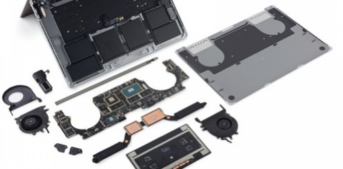

# 组件基础

## 为什么要组件化

前端领域，随着技术的发展，开发的复杂度也越来越高，传统开发模式总是存在着开发效率低，维护成本高等的弊端。


我们希望一个大且复杂的场景能够被分解成几个小的部分，这些小的部分彼此之间**互不干扰，可以单独开发，单独维护**，而且他们之间可以**随意的进行组合**。


就拿电脑主机来说，一台整机包括CPU，主板，内存，硬盘等，而这些部件其实都是由不同的公司进行生产的，他们彼此之间根据一套标准分别生产，最后组装在一起。当某个部件出现问题时，不需要将整台主机都进行维修，只需要将坏的部件拿下来，维修之后再将其组合上就可以了。



## 什么是组件化

我们在前端项目的开发流程中，把一个需求在一定的颗粒度范围内进行拆分，拆分后的单元具有独立功能和可复用性，具有可视和可交互的能力。通过这些单元之间的组合，能够完成具有一定复杂度的页面，这种化繁为简的思想在前端开发中的体现就是组件化。

页面由组件组成


## 组件如何实现

* **⓵ 使用原始方法来写UI页面**

```html
<!DOCTYPE html>
<html lang="en">

<head>
  <meta charset="UTF-8">
  <meta http-equiv="X-UA-Compatible" content="IE=edge">
  <meta name="viewport" content="width=device-width, initial-scale=1.0">
  <title>Document</title>
  <style>
    html,
    body {
      width: 100%;
      height: 100%;
      margin: 0;
      padding: 0;
    }

    #app {
      width: 100%;
      height: 100%;
    }

    .root {
      background-color: #f3f3f3;
      padding: 10px;
    }

    header {
      width: 100%;
      height: 100px;
      background-color: #cccccc;
    }

    main {
      margin-top: 10px;
      width: 100%;
      display: flex;
      justify-content: space-between;
    }

    article {
      display: flex;
      width: 70%;
      height: 500px;
      background-color: #cccccc;
      padding: 10px;
      box-sizing: border-box;
      flex-direction: column;
      align-items: flex-start;
    }

    .item {
      margin-top: 10px;
      width: 100%;
      height: 160px;
      background-color: #999999;
    }


    aside {
      width: calc(30% - 10px);
      height: 500px;
      background-color: #cccccc;
      padding-top: 20px;
      display: flex;
      justify-content: space-around;
      box-sizing: border-box;
    }

    .unit {
      width: 100px;
      height: 100px;
      background-color: #999999;
    }

  </style>
</head>

<body>
  <div id="app">
    
  </div>
  <script src="https://unpkg.com/vue@3"></script>

  <script>
    let App = {
      template: ` 
      <div class="root">
        <header></header>
        <main>
          <article>
            <div class="item"></div>
            <div class="item"></div>
          </article>
          <aside>
            <div class="unit"></div>
            <div class="unit"></div>
            <div class="unit"></div>
          </aside>
        </main>
      </div>
      `
    }
    let app = Vue.createApp(App);
    app.mount('#app');
  </script>
</body>

</html>
```

但是以上代码有一些问题，只是使用了Vue的最基本的代码，下面我们修改为组件

```html
<!DOCTYPE html>
<html lang="en">

<head>
  <meta charset="UTF-8">
  <meta http-equiv="X-UA-Compatible" content="IE=edge">
  <meta name="viewport" content="width=device-width, initial-scale=1.0">
  <title>Document</title>
  <style>
    html,
    body {
      width: 100%;
      height: 100%;
      margin: 0;
      padding: 0;
    }

    #app {
      width: 100%;
      height: 100%;
    }

    .root {
      background-color: #f3f3f3;
      padding: 10px;
    }

    header {
      width: 100%;
      height: 100px;
      background-color: #cccccc;
    }

    main {
      margin-top: 10px;
      width: 100%;
      display: flex;
      justify-content: space-between;
    }

    article {
      display: flex;
      width: 70%;
      height: 500px;
      background-color: #cccccc;
      padding: 10px;
      box-sizing: border-box;
      flex-direction: column;
      align-items: flex-start;
    }

    .item {
      margin-top: 10px;
      width: 100%;
      height: 160px;
      background-color: #999999;
    }


    aside {
      width: calc(30% - 10px);
      height: 500px;
      background-color: #cccccc;
      padding-top: 20px;
      display: flex;
      justify-content: space-around;
      box-sizing: border-box;
    }

    .unit {
      width: 100px;
      height: 100px;
      background-color: #999999;
    }

  </style>
</head>

<body>
  <div id="app">
    
  </div>
  <script src="https://unpkg.com/vue@3"></script>

  <script>
    let App = {
      template: ` 
      <div class="root">
        <Header></Header>
        <Main></Main>
      </div>
      `
    }
    let app = Vue.createApp(App);

    let Header = {
      template: `<header></header>`
    }
    app.component('Header', Header);


    let Article = {
      template: `
      <article>
        <div class="item"></div>
        <div class="item"></div>
      </article>
      `
    }
    app.component('Article', Article);


    let Aside = {
      template: `
        <aside>
          <div class="unit"></div>
          <div class="unit"></div>
          <div class="unit"></div>
        </aside>
        `
    }
    app.component('Aside', Aside);

    let Main = {
      template: `
      <main>
        <Article></Article>
        <Aside></Aside>
      </main>
      `
    }
    app.component('Main', Main);

    app.mount('#app');
  </script>
</body>

</html>
```

以上代码，还是有如下的问题

1. 所有组件写在一个html文件中，代码量会非常的大，不好修改
2. 写template的时候，没有代码提示
3. 所有样式混在一起，没有实现组件的单独开发，单独维护

解决方案: 单文件组件 + 脚手架
