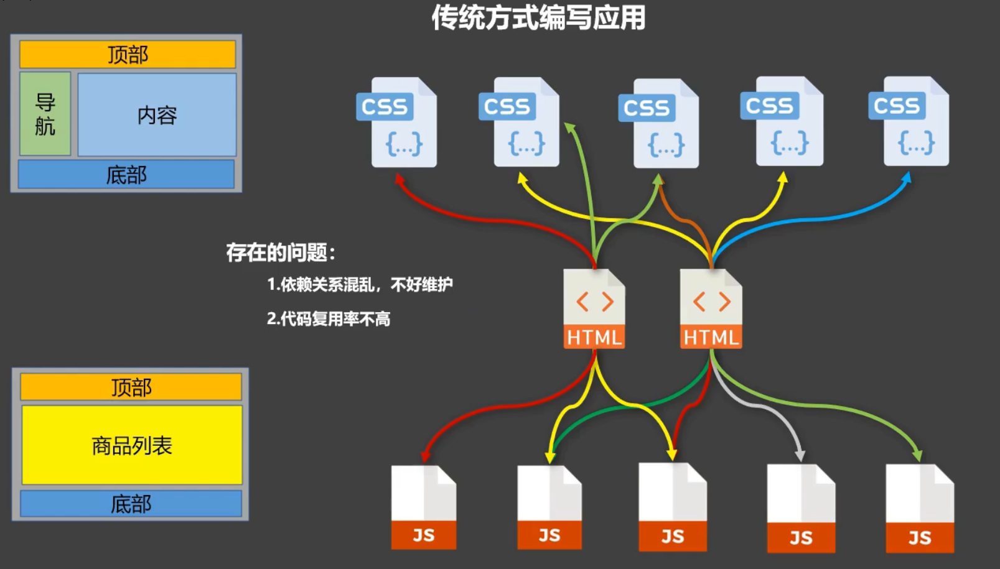
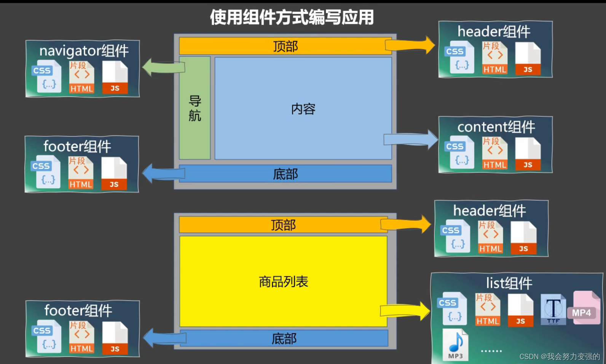
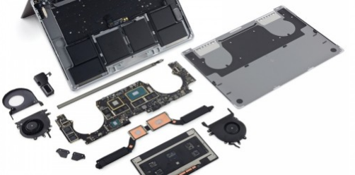

# 组件化

## Kn.1: 为什么要组件化

前端领域，随着技术的发展，开发的复杂度也越来越高，传统开发模式总是存在着开发效率低，维护成本高等的弊端。



我们希望一个大且复杂的场景能够被分解成几个小的部分，这些小的部分彼此之间**互不干扰，可以单独开发，单独维护**，而且他们之间可以**随意的进行组合**。



就拿电脑主机来说，一台整机包括CPU，主板，内存，硬盘等，而这些部件其实都是由不同的公司进行生产的，他们彼此之间根据一套标准分别生产，最后组装在一起。当某个部件出现问题时，不需要将整台主机都进行维修，只需要将坏的部件拿下来，维修之后再将其组合上就可以了。



## Kn.2: 什么是组件化

我们在前端项目的开发流程中，把一个需求在一定的颗粒度范围内进行拆分，拆分后的单元具有独立功能和可复用性，具有可视和可交互的能力。通过这些单元之间的组合，能够完成具有一定复杂度的页面，这种化繁为简的思想在前端开发中的体现就是组件化。

页面由组件组成


## Kn.3: Vue中的组件化

**当不使用构建步骤时**，一个 Vue 组件以一个包含 Vue 特定选项的 JavaScript 对象来定义：

```js
import { ref } from 'vue'

export default {
  setup() {
    const count = ref(0)
    return { count }
  },
  template: `
    <button @click="count++">
      You clicked me {{ count }} times.
    </button>`
}
```

**当使用构建步骤时**，我们一般会将 Vue 组件定义在一个单独的 .vue 文件中，这被叫做单文件组件 (简称 SFC)：

```html
<!-- 文件名：App.vue -->
<script setup>
import { ref } from 'vue'

const count = ref(0)
</script>

<template>
  <button @click="count++">You clicked me {{ count }} times.</button>
</template>
```

在实际的开发中，我们通常都会使用构建工具(例如:Vite)来构建项目，进行开发......
