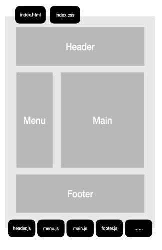
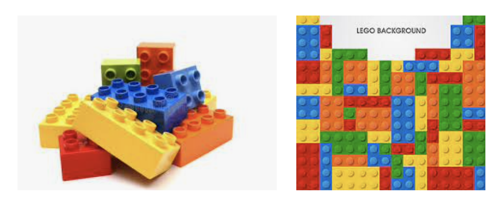

# 组件化

::: tip Object
这一小节，我们的目标是了解组件化开发，了解组件化开发的思想可以为未来开发复杂的页面做铺垫
:::

::: warning Path

1. 为什么需要组件化
2. 什么是组件化
3. 如何实现组件化
:::

::: info Experience

* **Kn. 1：为什么需要组件化**

  在很久之前，也就是移动端开发还不是很重要的时候，那时候开发页面是这样的:

  

  这样做，项目小，页面简单的时候，开发简单也快...随着项目复杂度变高，重复的地方越来越多，做了很多徒劳重复的事情。
  我们就可以试着把重复的东西抽离成公共的代码块
  比如:我们可以把整个页面想象成乐高拼图:

  

  对于页面是这样的
  

* **Kn. 2：组件化定义**

  组件化指的是页面上的每个 独立的 可视/可交互区域视为一个组件;
  每个组件对应一个工程目录，组件所需的各种资源都在这个目录下就近维护;每个组件相对独立，页面只不过是组件的容器，组件自由组合形成功能完整的界面;当不需要某个组件，或者想要替换组件时，可以整个目录删除/替换。

* **Kn. 3：如何实现组件化**

  组件 (Component) 是 Vue 最强大的功能之一。
  组件可以扩展 HTML 元素，封装可重用的代码。
  在较高层面上，组件是自定义元素，Vue.js 的编译器为它添加特殊功能。

  ```text
              ┌──────────► 全局组件
              │
  component ──┼──────────► .......
              │
              └──────────► 局部组件
  ```

:::

::: danger Note

* 【重点】

  * ⓵ 为什么需要组件化
  * ⓶ 什么是组件化
  * ⓷ 如何实现组件化
:::
