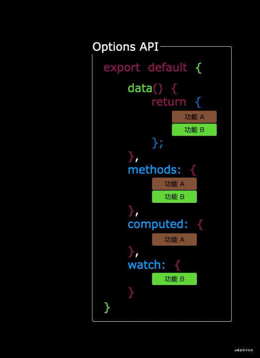
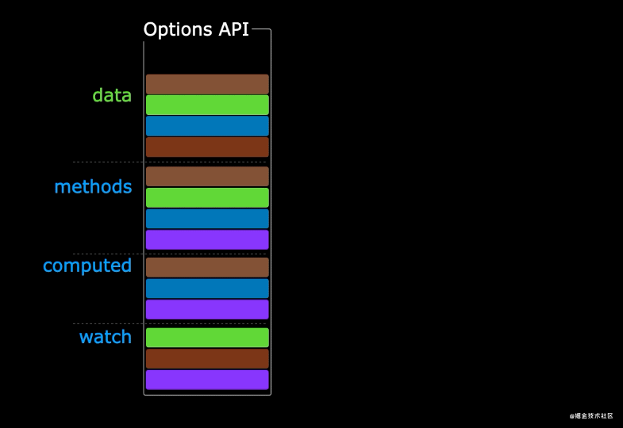
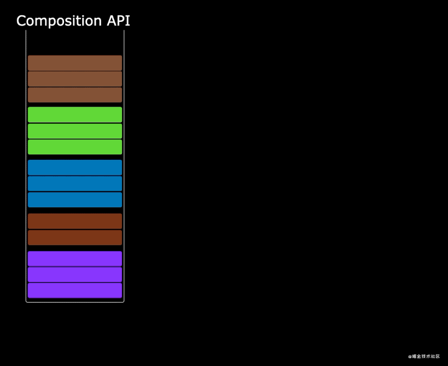

# 使用风格

::: tip 目标
这一小节，我们的目标是掌握Vue 3.x的 API 风格，Vue 的组件可以按两种不同的风格书写：选项式 API 和组合式 API。
:::

::: warning 步骤

1. Options API
2. Options 的优点
3. Composition API
4. Composition API 的优势
:::

::: info 体验

* **Kn.1：Options API**

  使用选项式 API，我们可以用包含多个选项的对象来描述组件的逻辑，例如 data、methods 和 mounted。
  选项所定义的属性都会暴露在函数内部的 this 上，它会指向当前的组件实例。

  ```html
  <script>
    export default {
      // data() 返回的属性将会成为响应式的状态
      // 并且暴露在 `this` 上
      data() {
        return {
          count: 0
        }
      },

      // methods 是一些用来更改状态与触发更新的函数
      // 它们可以在模板中作为事件监听器绑定
      methods: {
        increment() {
          this.count++
        }
      },

      // 生命周期钩子会在组件生命周期的各个不同阶段被调用
      // 例如这个函数就会在组件挂载完成后被调用
      mounted() {
        console.log(`The initial count is ${this.count}.`)
      }
    }
  </script>

  <template>
    <button @click="increment">Count is: {{ count }}</button>
  </template>
  ```

* **Kn.2：Options 的优点**

  Options API 容易理解，好上手。
  因为各个选项都有固定的书写位置（比如数据就写到data选项中，操作方法就写到methods中，等等）

* **Kn.3：Composition API**

  * ⓵ 正常写法

    ```html
    <script>
    import { defineComponent, ref } from 'vue';
    
    import HelloWorld from './components/HelloWorld.vue'
    import TheWelcome from './components/TheWelcome.vue'
    
    export default defineComponent({
      components: {
          HelloWorld,
          TheWelcome
      },
      setup() {
        let num = ref(0)
    
        return {
          num
        }
      }
    });
    </script>

    ```

  * ⓶ 语法糖写法

    ```html
    <script setup>
      import { ref, onMounted } from 'vue'

      // 响应式状态
      const count = ref(0)

      // 用来修改状态、触发更新的函数
      function increment() {
        count.value++
      }

      // 生命周期钩子
      onMounted(() => {
        console.log(`The initial count is ${count.value}.`)
      })
    </script>

    <template>
      <button @click="increment">Count is: {{ count }}</button>
    </template>
    ```

* **Kn.4：Composition API 的优势**

  在选项式API中，它将数据和逻辑进行了分离，所有不相关的数据被放置在了一起，所以不相关的逻辑被放置在了一起，随着应用规模的增加，项目将会变得越来越难以维护。

  

  在组合式 API 中，它将同一个功能的逻辑和数据放置在了一起，使同一个的功能代码更加聚合。

  

  同一个功能的代码可以被抽取到单独的文件中，使应用代码更加维护。

  
:::

::: danger 总结

* 【重点】
* 【难点】
* 【注意点】
:::
